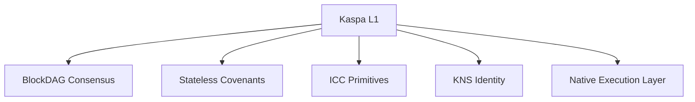
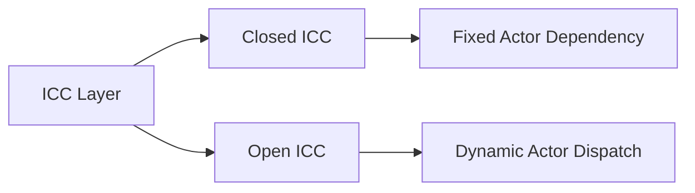
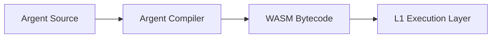
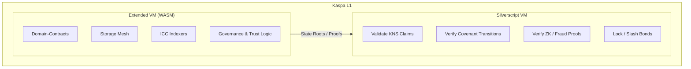
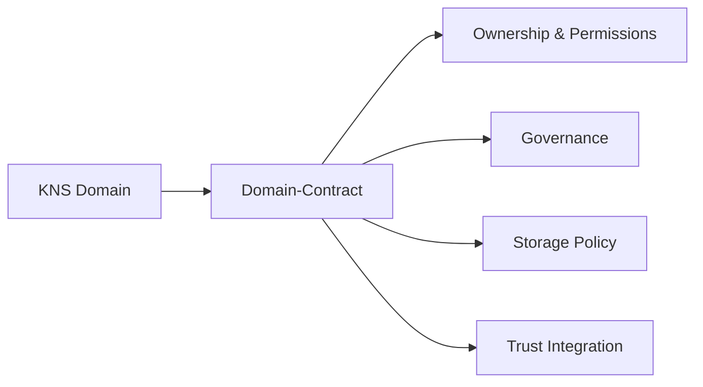
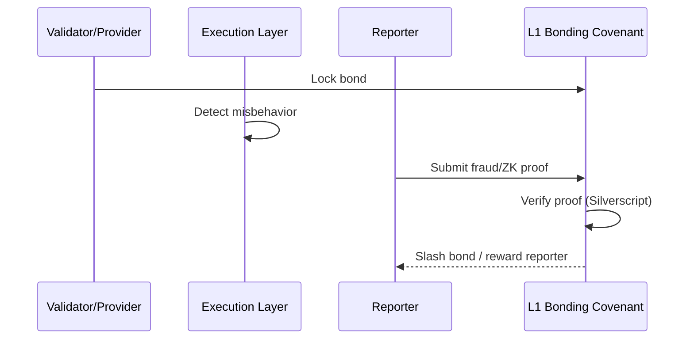
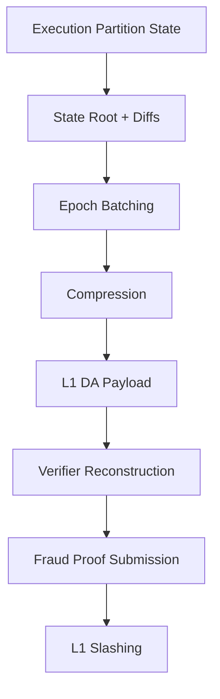
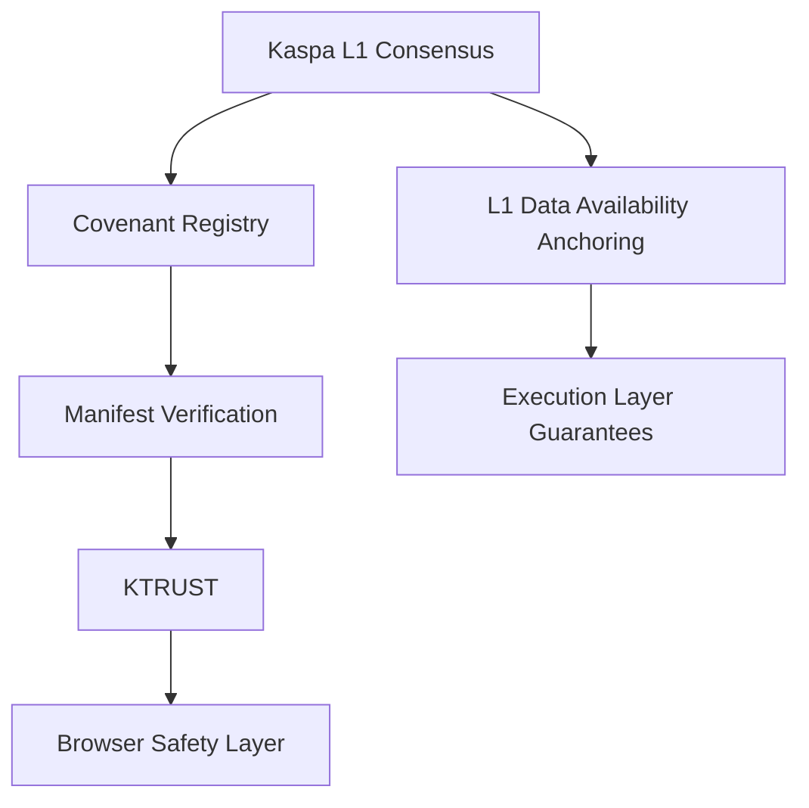
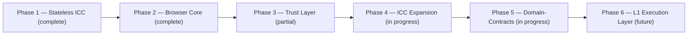

# 🟢⚫ KASPA Browser 
### Decentralized Internet Protocol on the Kaspa BlockDAG
**Whitepaper v4.4 — L1 Native Execution Edition**

---

## 1. Executive Summary

Kaspa Web is a decentralized internet protocol built directly on the Kaspa BlockDAG (L1). This edition introduces a native execution layer inside L1 itself, enabling:

- Decentralized digital identities (KNS Domains)
- Deterministic logic via ICC (Inter-Covenant Communication)
- Domain-Contracts (stateful actors)
- A decentralized trust layer (KTRUST)
- Decentralized storage (IPFS + Storage Mesh)
- Decentralized indexing (ICC Indexers)
- On-chain governance contracts
- Extended VM execution (WASM)
- Slashing and fraud proofs
- L1 Data Availability anchoring
- Parallel execution via GHOSTDAG

This architecture is explicitly framed as **not** an L2, rollup, or sidechain — it is presented as a native L1 execution environment layered on top of Kaspa's stateless covenant model.

> **Note on framing:** this is a meaningful architectural claim, not a stylistic one — it means every property described below (statefulness, gas metering, WASM execution) is asserted to live inside L1 consensus itself, rather than in a separate settlement layer. That is a substantially stronger and more difficult engineering claim than the Subnet-based design in the previous edition, and it should be validated against Kaspa's actual, current L1 capabilities before this document is presented as a description of deployed or deployable functionality.

---

## 2. Motivation

The traditional web relies on centralized registrars, mutable server-hosted content, private indexers, opaque trust systems, centralized governance, and non-verifiable storage.

Kaspa Web replaces these with cryptographic identity, deterministic logic, decentralized storage, decentralized trust, decentralized indexing, decentralized governance, and contract-driven domains.

---

## 3. Kaspa L1 — Deterministic Base Layer

Kaspa L1 provides a high-throughput BlockDAG, deterministic validation, stateless covenants, ICC primitives, KNS domain identity, manifest binding, and cryptographic security — with no loops, no recursion, no gas, and no global state.

Kaspa L1 is the security anchor. The execution layer described in this edition extends L1 without creating a separate chain.

---

## 4. ICC — Inter-Covenant Communication

ICC is a deterministic dependency mechanism rather than a contract call: a transition is valid only when a specified foreign transition is also present and shaped as expected.

**ICC Primitives:** `id.co_spent()` (require covenant presence), `observes` (inspect foreign covenant inputs/outputs), `emits` (authorized output shape), `become` (successor actor), `actor_type<State>` (dynamic ICC handle).

**ICC Types:** Closed ICC (fixed dependency on known actors) and Open ICC (dynamic dispatch over actor templates).

**Justification:** Expressing dependencies as a presence-and-shape check rather than a synchronous call keeps covenant logic stateless while still enforcing conditional relationships between actors.

---

## 5. Argent — Actor Language

Argent is a high-level language for building covenant applications, providing state definitions, actor ownership, entry transitions, `emits` output declarations, `become` successor logic, ICC primitives, virtual slots, hidden ABI state, and route families.

In this edition, Argent compiles to WASM bytecode executed **inside the L1 execution layer**, rather than on a separate Subnet.

---

## 6. Execution Architecture: Silverscript L1 & Extended L1 VM

Kaspa Web uses a dual-engine execution model, with both engines operating inside L1.

### 6.1 L1 Validation — Silverscript VM

Silverscript is Kaspa's native, Turing-incomplete L1 scripting engine: loop-free, recursion-free, zero-gas, deterministic, and stateless.

**Responsibilities:** validate identity claims (KNS), verify covenant transitions, validate ICC commitments, verify ZK/fraud proofs, and lock/slash collateral via Bonding Covenants.

**Core opcodes:** `OP_COV_INPUT`, `OP_COV_OUTPUT`, `OP_CO_SPENT`, `OP_OBSERVE_INPUT`, `OP_OBSERVE_OUTPUT`, `OP_VALIDATE_TEMPLATE`, `OP_VERIFY_ZK_PROOF` (constant-time ZK verification), `OP_VERIFY_MERKLE_PATH` (loop-free Merkle membership verification).

### 6.2 L1 Execution Layer — Extended VM (WASM)

This is the stateful, gas-metered counterpart described in prior editions as running on a separate Subnet — here it is instead framed as running **within** L1.

**Properties:** Turing-complete, stateful, gas-metered, actor-oriented, parallel execution.

**Responsibilities:** execute Domain-Contracts, manage Storage Mesh logic, run ICC Indexers, process KTRUST reports, execute governance logic, run AI agents, and maintain state roots and validity proofs.

**Justification:** Framing the Extended VM as part of L1 rather than as an external Subnet is intended to preserve a single unified security domain — but it also means the Extended VM's gas-metered, stateful, Turing-complete execution must coexist with, and not compromise, the loop-free and stateless guarantees that define Silverscript and Kaspa's base-layer consensus. This is the central engineering claim of this edition and the one most in need of independent verification.

---

## 7. Domain-Contracts

Domain-Contracts are autonomous actors running inside the L1 execution layer, providing domain ownership, permissions, governance, storage policies, trust integration, indexing integration, and support for extensions and plugins.

Domain-Contracts require ICC expansion, the Extended VM, hidden ABI state, route-family commitments, and hard-fork activation.

---

## 8. Trust Layer (KTRUST) — Slashing Model

1. **Bond Locking (L1):** validators and storage providers lock KAS inside an L1 Bonding Covenant.
2. **Challenge Window:** the execution layer detects misbehavior.
3. **Fraud Proof Submission (L1):** a verifier submits a ZK or deterministic fraud proof.
4. **Automatic Slashing (L1):** Silverscript verifies the proof; the bond is burned or awarded.

---

## 9. Storage Layer — IPFS + Storage Mesh

IPFS provides decentralized content addressing without persistence guarantees. The Storage Mesh, running in the L1 execution layer, adds incentivized pinning, replication contracts, availability proofs, slashing for data loss, storage governance, and treats storage providers as actors.

---

## 10. ICC Indexers

Indexers are actors inside the L1 execution layer, responsible for domain registry scanning, manifest mapping, trust mapping, storage mapping, and deterministic queries.

**Security & DA integration:** indexers reconstruct state from DA payloads, detect fraud, and submit fraud proofs. They earn KAS per query and are slashed for incorrect results.

---

## 11. Governance & Voting

Governance contracts provide proposal creation, voting execution, quorum enforcement, cooling periods, and Domain-Contract updates.

---

## 12. User Roles

Visitor, Reader, Reporter, Verifier, Trust Participant, Storage Provider, Agent.

---

## 13. Domain Owner Roles

Owner, Admin, Controller, Storage Controller, Trust Delegate, Governance Participant.

---

## 14. L1 Execution Partitions (Native Subnets)

Execution partitions provide stateful actors, parallel execution, multi-actor logic, storage contracts, trust contracts, governance contracts, indexers, and AI agents — all inside L1.

### State Verification & Data Availability (DA)

- State roots and compressed diffs are committed to L1 payloads.
- Verifiers can reconstruct state even under withholding attempts.
- Fraud proofs — and therefore slashing — remain enforceable.

### Performance Guarantees

To prevent round-trip-time degradation: DA commits are batched into epochs, state diffs are compressed, and a storage fee premium discourages state bloat.

**Justification:** Calling these "Native Subnets" rather than external Subnets is a naming choice with real consequences: it asserts that partitioning and parallel execution happen under the same consensus and DA guarantees as the rest of L1, rather than in an environment that merely reports back to L1. That distinction should be explicit anywhere this document is used to describe actual system behavior, since it is the difference between one security domain and two.

---

## 15. Concurrency Model — Hybrid Architecture

**L1 Concurrency (UTXO Parallelism):** used for KNS, stateless ICC, and covenant transitions, via UTXO splitting, UTXO chaining, and parallel validation through GHOSTDAG.

**Execution Layer Concurrency (Actor Model):** used for Domain-Contracts, Storage Mesh, indexers, governance, and trust logic, via partitioned actors, virtual slots, read/write sets, parallel reads, and serialized writes.

---

## 16. Tokenomics, Gas & Slashing

**L1 Gas:** none — fee equals transaction size.

**Execution Layer Gas:** charged for WASM cycles, actor transitions, DA footprint, and storage footprint.

**Slashing:** bonds locked in L1, fraud proofs submitted to L1, verified by Silverscript, slashing applied automatically.

---

## 17. Security Model

---

## 18. Roadmap

---

## 19. Future Outlook

Kaspa Web is designed to evolve into a decentralized internet stack in which domains are contracts, websites are trust-minimized, storage and indexing are decentralized, governance is open, ICC underlies all logic, the L1 execution layer provides scalable computation, and Data Availability anchoring underwrites fraud-proof, censorship-resistant verification — anchored throughout by the Kaspa BlockDAG.

---

## 20. Node Responsibilities in the Kaspa Native Execution Layer

Kaspa nodes serve as the unified backbone of the decentralized web stack, combining the following roles:

- **L1 Consensus Validator** — validate blocks, transactions, covenants, ICC, DA payloads, and fraud proofs; enforce slashing.
- **L1 Execution Engine** — execute WASM; run Domain-Contracts, Storage Mesh, Indexers, Governance, and the Trust Layer.
- **Data Availability Provider** — publish state roots and diffs, store historical state, and provide data for fraud proofs.
- **Bonding Covenant Enforcer** — verify collateral, verify ZK proofs and Merkle paths, and slash malicious actors.
- **ICC Router** — route actor transitions and validate route families and dependencies.
- **Storage Mesh Node** — store content, prove availability, earn rewards, and risk slashing.
- **Indexer Node** — index domains, manifests, trust, and storage; provide deterministic queries.
- **Governance Node** — vote, propose, validate outcomes, and execute governance logic.

**Justification:** Consolidating all of these roles into a single node type is a strong claim about hardware and bandwidth requirements — a node performing consensus validation, WASM execution, DA storage, and indexing simultaneously will have materially higher resource requirements than a validator in the stateless-L1 design described in earlier sections. That trade-off (decentralization/accessibility of node operation vs. unified execution) is worth stating explicitly rather than leaving implicit.
