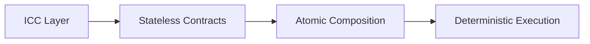
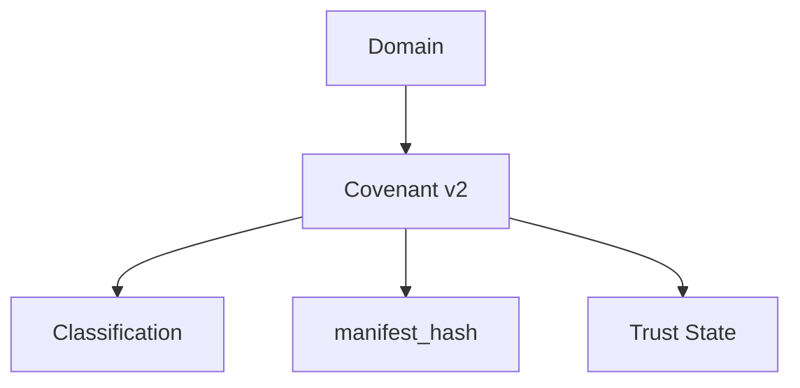
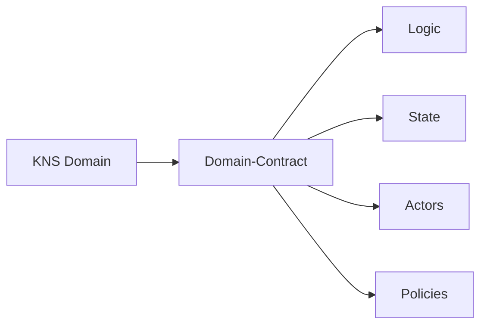
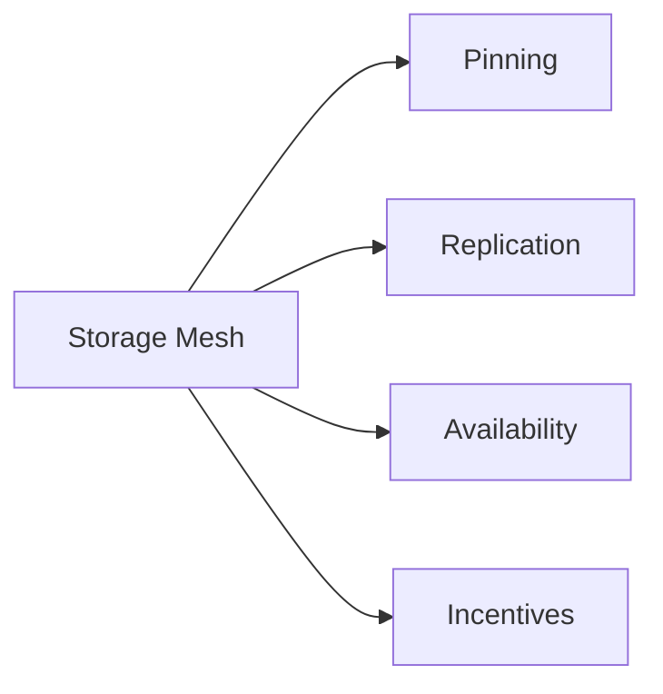
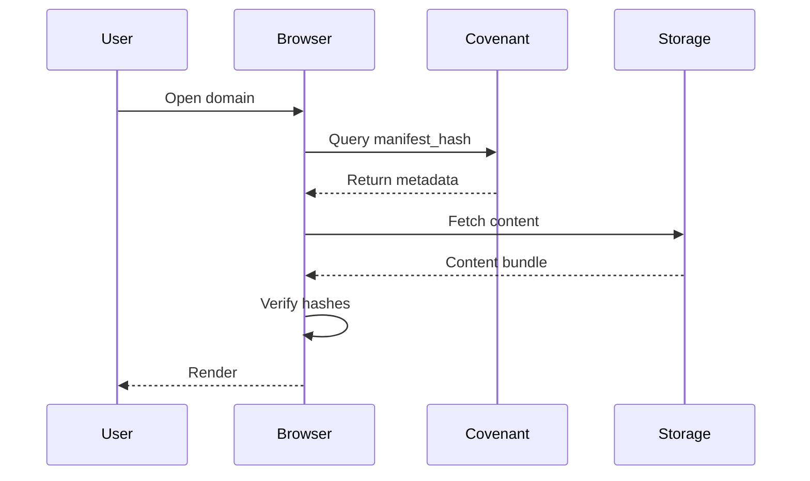
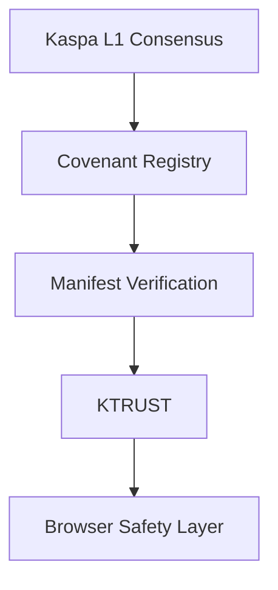
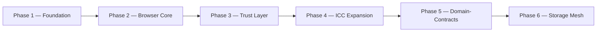

# 🟢⚫ KASPA WEB  
### Decentralized Internet Protocol  
**Whitepaper v2.0 — Protocol Architecture & Future Upgrade Path**

---

## 2. Executive Summary

Kaspa Web is a decentralized internet protocol built natively on top of the Kaspa BlockDAG. It establishes an architecture through which domains, content, identity, and trust can exist in a cryptographically verifiable manner, without dependence on centralized hosting providers, certificate authorities, or traditional DNS registrars.

The protocol is composed of a set of interlocking layers: Inter-Contract Communication (ICC), Covenant v2 domain logic, manifest-driven content binding, a distributed storage layer, and a reputation-based trust framework (KTRUST). Together, these layers allow a domain to be registered, verified, and rendered entirely from on-chain and cryptographically anchored off-chain data.

This whitepaper describes both the architecture that is operational today and the upgrade path — governed by the protocol's RFC process — toward a future in which domains can act as autonomous, self-governing entities on Kaspa L1.

## 3. Vision & Problem Statement

The traditional web depends on a small number of centralized control points: domain name registrars, certificate authorities, and hosting providers. Each of these represents a point of censorship, seizure, or single-party failure. A domain can be suspended, a certificate revoked, or a host taken offline, independent of the wishes of the domain's rightful owner or its users.

Kaspa Web's mission is to remove these centralized control points by anchoring domain ownership, content integrity, and trust signaling directly to Kaspa's BlockDAG. Under this model, domains become censorship-resistant and cryptographically verifiable, and their ownership and identity no longer depend on any traditional registrar or intermediary.

## 4. Technical Architecture v2.0

### 4.1 ICC — Inter-Contract Communication

ICC defines the deterministic contract physics underlying stateless, UTXO-based contracts on Kaspa. It provides the rules by which contracts compose and interact, enabling atomic composition of contract logic without introducing global mutable state at the consensus layer.

Because ICC operates without global state, every interaction between contracts remains deterministic and independently verifiable. This preserves Kaspa's core consensus guarantees while still allowing complex, multi-step interactions between otherwise independent contracts — a prerequisite for any higher-order structure, such as a domain, that needs to combine several discrete pieces of on-chain logic into one coherent identity.

### 4.2 Covenant v2 — ICC-Powered Domain Logic

Covenant v2 is the mechanism through which a domain's classification, content pointer (`manifest_hash`), and trust metadata are bound directly into its on-chain identity. It is implemented as a contract that leverages ICC's deterministic composition rules to enforce which updates are valid and which are not.

Binding classification, content, and trust state into a single covenant means that a domain's essential properties cannot be altered outside of consensus-enforced rules. Ownership transfer, content updates, and trust adjustments all become subject to the same verifiable logic, rather than being managed by an off-chain database that a third party could alter unilaterally. This is the foundation that today's Kaspa Web already provides, independent of any future upgrade.

### 4.3 Domain-Contracts (Future L1 Upgrade)

Where a Covenant v2 UTXO carries state and classification, a Domain-Contract additionally carries its own logic, defined actor permissions, and enforceable policies. This extends a domain from a static, passively-updated record into a self-governing, programmable entity.

A Domain-Contract generalizes the covenant model by attaching role-based actor permissions (owners, delegates, publishers, agents) and consensus-enforced policy logic to the domain itself. This allows a domain to encode governance rules — such as multi-signature approval for content changes, or scheduled and conditional updates — directly into its on-chain representation, rather than relying on off-chain coordination. This capability is architecturally specified but not yet active on mainnet; its availability depends on the upgrade path described in Section 5.

### 4.4 RFC — Protocol Evolution Mechanism

The RFC (Request for Comment) process is Kaspa Web's formal specification and evolution mechanism. Any change that affects consensus-level behavior — including the activation of Domain-Contracts or expansion of ICC's primitive set — must pass through RFC review before it can be scheduled into a coordinated hard-fork.

The RFC process exists to ensure that protocol changes are reviewed for safety, backward compatibility, and alignment with the network's decentralization guarantees before they are activated. This deliberately conservative process means that features described as "future" in this document are not merely product roadmap items — they require community and technical consensus before they can be enabled at the consensus layer.

## 5. Protocol Upgrade Notice — RFC + ICC Required

**Full Domain-Contract functionality requires waiting for the upcoming RFC + ICC upgrade and a coordinated hard-fork.**

Covenant v2, manifest binding, KNS identity, and stateless validation are operational today on Kaspa L1 and do not depend on this upgrade. Domain-Contracts, autonomous domain behaviors, and Storage Mesh incentives are theoretical components that depend on ICC expansion and consensus-level activation, and should be understood as a specified future direction rather than a currently available feature.

## 6. Storage Layer Architecture v1.1

### 6.1 On-Chain Binding

Each domain's content is referenced on-chain through a `manifest_hash`: a cryptographic pointer bound into the domain's Covenant v2 record. The manifest hash allows any retrieved content bundle to be verified against the exact version the domain owner committed to on-chain, regardless of where that content is physically hosted.

### 6.2 Off-Chain Storage Sources

Content bundles referenced by a manifest hash may be retrieved from several sources:

- IPFS
- Storage Mesh (future)
- Signed bundles
- HTTP fallback

Regardless of source, all retrieved content is verified against the on-chain manifest before being rendered, so the integrity guarantee does not depend on trusting any particular storage provider.

### 6.3 Kaspa Storage Mesh (Future RFC)

The Storage Mesh is designed as an incentive-driven replication layer: participants are compensated for pinning and replicating content bundles, which improves availability without requiring a single centralized host. Because this incentive and slashing model requires consensus-level economic primitives, it is categorized as a future component pending RFC ratification, alongside Domain-Contracts.

### 6.4 Verification Pipeline

This pipeline ensures that every rendered page is checked against its on-chain commitment before being shown to the user. A browser implementing Kaspa Web never trusts a storage source directly — it only trusts the hash comparison against the Covenant-anchored manifest, which keeps content integrity anchored to consensus rather than to any single storage backend.

## 7. Security & Integrity Model v2.0

Kaspa Web's security model is layered: consensus provides the base guarantee of ordering and finality; the Covenant registry enforces which domain records are valid; manifest verification ensures retrieved content matches what was committed on-chain; KTRUST provides a reputation signal layer on top of that; and the browser safety layer applies user-facing checks before rendering. Each layer depends only on the guarantees of the layer beneath it, so a failure or compromise at the storage or trust layer cannot retroactively alter what has already been committed to consensus.

## 8. Identity & Ownership v2.0

Domain identity in Kaspa Web is established through KNS (Kaspa Name Service) and enforced by consensus rather than by a registrar's database. Once a domain is registered on-chain, its ownership record persists as part of the BlockDAG's history: it can be transferred according to the covenant's rules, but it cannot be revoked, suspended, or seized by any third party, including Kaspa Web's own maintainers. This gives domain owners a form of property right that does not depend on continued goodwill from an intermediary.

## 9. Governance & Evolution v2.0

Kaspa Web's governance operates on two distinct layers:

1. **Protocol Governance (RFC)** — governs consensus-level changes to Kaspa Web itself, including ICC expansion and the activation of Domain-Contracts. Changes at this layer require RFC review and a coordinated hard-fork.
2. **Application Governance (Domain-Contract policies)** — governs how an individual domain manages its own updates, permissions, and multi-party decisions once Domain-Contracts are active. This layer is scoped entirely to the domain itself and does not require any protocol-level change to modify.

Separating these two layers means that individual domains can eventually adopt custom governance logic without requiring a change to the underlying protocol, while changes that affect consensus guarantees remain subject to the network's more conservative RFC process.

## 10. Roadmap v2.0

- **Phase 1 — Foundation:** Covenant v2, manifest binding, KNS identity, and stateless validation, forming the operational base layer.
- **Phase 2 — Browser Core:** Client-side verification of manifests and content bundles against on-chain records.
- **Phase 3 — Trust Layer:** Introduction of KTRUST reputation signaling across domains.
- **Phase 4 — ICC Expansion:** RFC-ratified expansion of ICC primitives beyond the current stateless subset.
- **Phase 5 — Domain-Contracts:** Activation of programmable domain logic, actor permissions, and policy enforcement, contingent on the Phase 4 upgrade and a coordinated hard-fork.
- **Phase 6 — Storage Mesh:** Activation of incentive-driven replication and availability guarantees for content storage.

## 11. Future Outlook

Kaspa Web's long-term direction is a decentralized internet architecture in which domains, content, and trust are all anchored to a single, censorship-resistant BlockDAG. As the RFC process ratifies ICC expansion and Domain-Contracts become active, domains will be able to move beyond static, passively-updated records toward programmable entities capable of enforcing their own governance policies and interacting with one another under consensus-verified rules. Covenant v2 and manifest binding already provide a working foundation for this vision today; the phases described in Section 10 chart the path by which the fuller architecture is intended to be realized.
