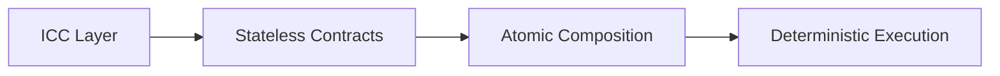
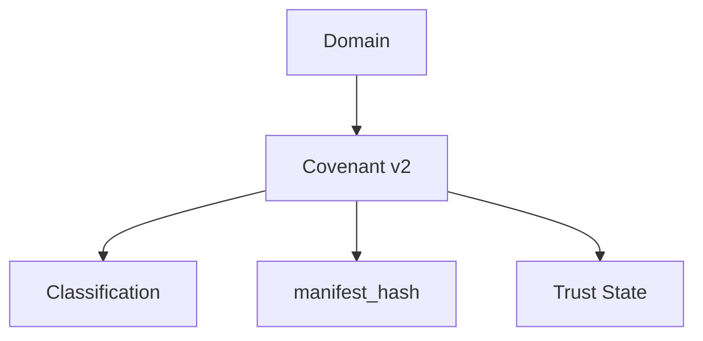
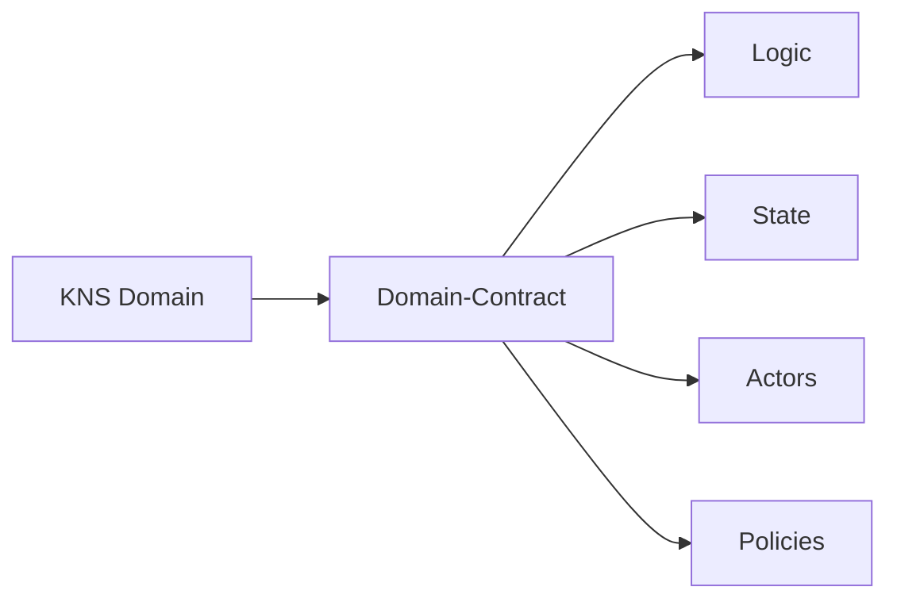
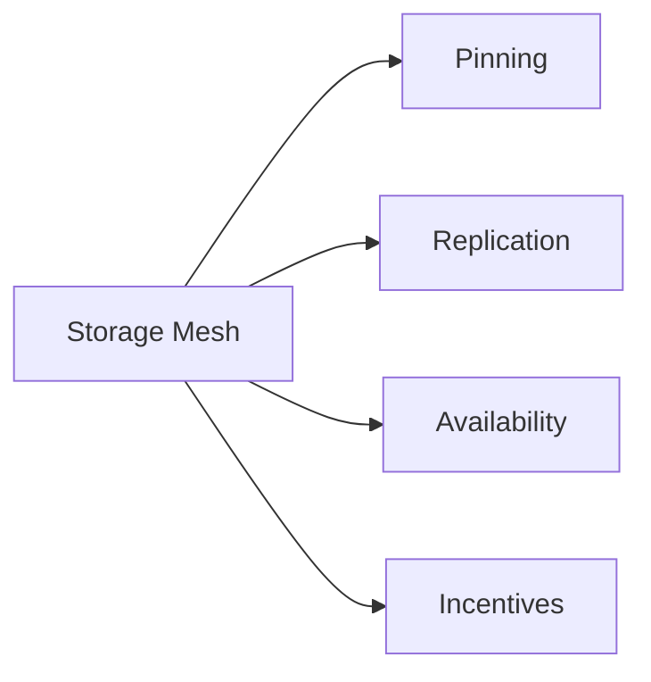
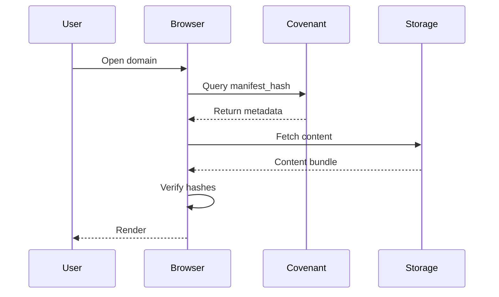
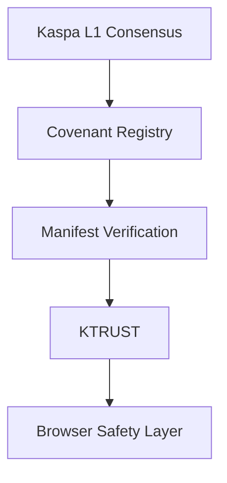
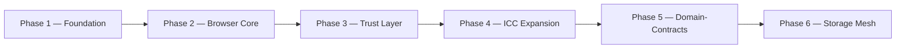

# 🟢⚫ KASPA Browser   
### Decentralized Internet Protocol  
**Whitepaper v2.0 — Protocol Architecture & Future Upgrade Path**

---

## 1. Executive Summary

Kaspa Web is a decentralized internet protocol designed to replace the centralized infrastructure of the traditional web with a fully verifiable, cryptographically anchored architecture built on top of the Kaspa BlockDAG. Rather than relying on domain registrars, centralized servers, and opaque trust intermediaries, Kaspa Web establishes ownership, content delivery, and trust as first-class protocol primitives.

This whitepaper introduces Protocol Architecture v2.0, a structural evolution of the Kaspa Web design that formalizes the role of Inter-Contract Communication (ICC), introduces Covenant v2 as an ICC-powered domain logic layer, and defines a forward path toward autonomous Domain-Contracts. It further specifies a Storage Mesh architecture for decentralized content availability and a Trust Layer v2 for reputation and verification.

Certain capabilities described in this document — most notably full Domain-Contract autonomy and native Storage Mesh incentives — require a coordinated protocol upgrade through the Request for Comments (RFC) process and the activation of ICC at the consensus layer. Until that upgrade is finalized and activated through a coordinated hard-fork, these components remain part of the protocol's forward specification rather than its currently active feature set.

## 2. Vision & Problem Statement

The traditional web is structurally centralized. Domain ownership is mediated by registrars subject to seizure, censorship, and arbitrary policy enforcement. Content is hosted on servers controlled by single entities, creating availability risk and unilateral takedown power. Trust signals — certificates, verification badges, reputation scores — are issued by centralized authorities with no cryptographic accountability to the end user.

Kaspa Web's mission is to reconstruct these primitives as protocol-level, verifiable constructs:

- **Ownership** becomes a cryptographic fact anchored to Kaspa L1, not a database entry controlled by a registrar.
- **Content delivery** becomes a verifiable retrieval process across a decentralized Storage Mesh, not a request to a single origin server.
- **Trust** becomes a computable, auditable state derived from on-chain and protocol-level signals, not an opaque third-party attestation.

The result is an internet layer where the guarantees a user relies on — that a domain belongs to who it claims to, that content has not been tampered with, that a site's trust status reflects real on-chain history — are enforced by the protocol itself rather than by institutional trust.

## 3. Technical Architecture v2.0

### 3.1 ICC — Inter-Contract Communication

ICC (Inter-Contract Communication) is the deterministic contract physics layer underlying Kaspa Web's protocol logic. It defines the rules by which stateless contracts observe one another, compose atomically within a single transaction context, and execute deterministically without relying on external state or off-chain coordination.

ICC is not a messaging system in the conventional sense. It does not queue or relay messages between independent processes. Instead, it defines a set of primitives — observation, co-spending, and atomic composition — that allow multiple contracts to participate in a single validated transaction as though they were physically linked components obeying consistent rules.

**Justification:** The ICC Layer establishes the ground rules under which Stateless Contracts operate. Because those contracts hold no persistent internal state between transactions, their behavior is fully defined by their inputs, outputs, and the constraints imposed by ICC at execution time. Atomic Composition ensures that when multiple contracts interact — for example, a domain contract and a trust contract — they either all succeed together or the entire transaction fails, with no partial or inconsistent states possible. This directly yields Deterministic Execution: given a fixed transaction and a fixed set of contract rules, the outcome is fully predictable and independently verifiable by any observer, without requiring trust in a centralized executor.

### 3.2 Covenant v2 — ICC-Powered Domain Logic

Covenant v2 is the domain logic layer of Kaspa Web, implemented as an ICC contract. Where the original covenant model enforced simple spending conditions, Covenant v2 extends this into a structured domain object that carries classification metadata, a binding to off-chain content through a manifest hash, and a trust state that reflects the domain's verified history.

**Justification:** Representing a Domain as a Covenant v2 object allows all of a domain's essential properties to be enforced by the same deterministic rules that govern any other on-chain covenant. Classification allows the protocol and downstream applications to reason about the type and purpose of a domain without external lookups. The manifest_hash field creates a cryptographic binding between the on-chain covenant and the off-chain content it represents, so that any change in content is immediately detectable as a hash mismatch. Trust State allows reputation and verification history to travel with the domain itself, rather than being reconstructed from external, potentially inconsistent sources. Together, these fields make the domain a self-describing, self-verifying unit within the protocol.

### 3.3 Domain-Contracts (Future L1 Upgrade)

Domain-Contracts represent the forward-looking evolution of Covenant v2 into fully autonomous, stateful contract objects. Where Covenant v2 is a relatively static binding of classification, content hash, and trust state, a Domain-Contract is designed to hold its own logic, internal state, a defined set of authorized actors, and configurable policies governing its behavior.

**Justification:** Elevating a KNS Domain into a full Domain-Contract allows domain owners to encode governance and operational rules directly at the protocol level rather than through off-chain agreements or centralized administration panels. Logic defines the domain's programmable behavior; State persists the domain's evolving condition across transactions; Actors formally enumerate who is authorized to act on the domain's behalf and under what constraints; and Policies allow fine-grained, auditable rules — such as storage requirements, delegation limits, or transfer conditions — to be enforced automatically by the protocol. This architecture requires consensus-level support for stateful ICC execution, which is why it is specified here as a future L1 upgrade rather than a currently active capability.

### 3.4 RFC — Protocol Evolution Mechanism

The Request for Comments (RFC) process is the formal mechanism through which Kaspa Web's protocol specification evolves. An RFC documents a proposed change to consensus rules, ICC primitives, or protocol-level data structures in sufficient technical detail to be implemented, reviewed, and independently verified by node operators and protocol contributors before activation.

**Justification:** A protocol that governs ownership, trust, and content integrity for a decentralized internet cannot evolve through informal or unilateral changes. The RFC process ensures that any modification to core primitives — including the activation of stateful ICC required for Domain-Contracts — is subject to open technical review and requires broad coordination before it is deployed. This preserves the deterministic, trust-minimized guarantees that the rest of the protocol depends on.

## 4. Protocol Upgrade Notice — RFC + ICC Required

Full Domain-Contract functionality requires waiting for the upcoming RFC + ICC upgrade and a coordinated hard-fork.

Until this upgrade is specified, reviewed, and activated across the network, Domain-Contracts as described in Section 3.3 remain a forward specification. Current protocol behavior operates through Covenant v2 as described in Section 3.2, which provides classification, content binding, and trust state without requiring stateful consensus-level execution.

## 5. Storage Layer Architecture v1.1

### 5.1 On-Chain Binding

Each domain's content is bound to its on-chain covenant through a manifest_hash: a cryptographic digest of the content manifest describing the structure, location pointers, and integrity hashes of the domain's off-chain content. This binding is the sole on-chain footprint required to verify that retrieved content matches what the domain owner has committed to.

### 5.2 Off-Chain Storage Sources

Content referenced by a manifest_hash may be retrieved from multiple off-chain sources, including:

- IPFS
- Storage Mesh (see 5.3)
- Signed Bundles
- HTTP fallback

### 5.3 Kaspa Storage Mesh (Future RFC)

The Storage Mesh is a proposed decentralized storage network purpose-built for Kaspa Web content, providing pinning, replication, availability guarantees, and economic incentives for storage providers.

**Justification:** Pinning ensures that content is not garbage-collected by storage nodes prematurely. Replication distributes copies across multiple independent providers, removing single points of failure. Availability mechanisms allow the network to verify, at any time, that committed content can actually be retrieved rather than merely assumed to exist. Incentives align the economic interests of storage providers with the network's need for durable content availability, converting storage from a best-effort courtesy into an economically enforced guarantee. This architecture is specified as a future RFC because its incentive and slashing mechanisms depend on protocol-level primitives not yet activated.

### 5.4 Verification Pipeline

## 6. Security & Integrity Model v2.0

Kaspa Web's security model is structured as a layered stack, in which each layer's guarantees depend on the integrity of the layer beneath it.

Kaspa L1 Consensus anchors all higher-layer guarantees in the security of the underlying BlockDAG. The Covenant Registry provides an authoritative, on-chain record of domain ownership and classification. Manifest Verification ensures that retrieved content cryptographically matches what the domain owner has committed to on-chain. KTRUST aggregates verified signals into a computable trust state for the domain. The Browser Safety Layer is the final client-side enforcement point, translating the verified trust state and manifest integrity into concrete warnings, restrictions, or confirmations presented to the end user.

## 7. Identity & Ownership v2.0

Domain identity within Kaspa Web is anchored permanently to the Kaspa L1 covenant that represents it. Ownership is a cryptographic fact, provable by control of the relevant keys, rather than a record held by a third-party registrar. A domain's lifecycle — registration, transfer, renewal, and, where applicable, expiration or reclamation — is governed entirely by the covenant's on-chain rules, ensuring that ownership history is fully auditable and independent of any centralized authority's continued cooperation.

## 8. Governance & Evolution v2.0

Kaspa Web distinguishes between protocol governance and application governance. Protocol governance concerns changes to the core specification itself — consensus rules, ICC primitives, and covenant structures — and proceeds through the RFC process described in Section 3.4. Application governance concerns decisions made within an individual domain or service built on top of the protocol, such as content moderation policies or delegated administration, and is governed by the rules encoded in that domain's own covenant or, in the future, Domain-Contract. This separation ensures that the protocol's core guarantees remain stable and narrowly scoped, while individual applications retain full flexibility to define their own governance models on top of it.

## 9. Roadmap v2.0

## 10. Future Outlook

The long-term trajectory of Kaspa Web is a fully decentralized internet stack in which ownership, content integrity, trust, and governance are all enforced as protocol-level guarantees rather than institutional assurances. As ICC expansion and the Domain-Contract upgrade path are formalized through the RFC process and activated through coordinated protocol upgrades, the network moves from its current foundation — verifiable ownership and content binding through Covenant v2 — toward a state in which domains operate as autonomous, self-governing contract objects backed by a resilient, incentive-aligned Storage Mesh. This trajectory positions Kaspa Web as infrastructure for an internet whose foundational guarantees are cryptographic rather than institutional.

About This Document — Vision, Foundations & Feasibility Disclaimer
Kaspa Web is a forward‑looking architectural vision.  
It describes a potential evolution of the Kaspa ecosystem that builds on
ICC, Covenants, SilverScript, DA anchoring, and future protocol extensions
such as Execution Partitions, Stateful Actors, WASM execution, decentralized
indexing, storage layers, and trust mechanisms.

The foundational components required for this vision do exist today in Kaspa.  
These include:

the high‑throughput BlockDAG

stateless validation

zero‑gas fee model

covenant‑based spending rules

SilverScript

ICC primitives (RFC)

manifest binding

KNS identity layer

pruning‑friendly DA anchoring

These elements form a real, working base layer that makes the proposed
architecture feasible in principle and compatible with Kaspa’s core design.

However, the advanced mechanisms described in this document — including
WASM execution, state commitments, execution partitions, storage mesh,
trust layer, and decentralized indexing — are not implemented in the
current protocol.  
They represent future extensions that require:

deep feasibility analysis

extensive research and prototyping

multi‑phase protocol upgrades

validation by Kaspa Core developers

long‑term engineering effort

This whitepaper should therefore be understood as a vision document,
not a specification of existing functionality.
It outlines what could be built on top of Kaspa’s proven foundations,
pending rigorous feasibility studies and community consensus.
