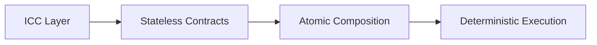
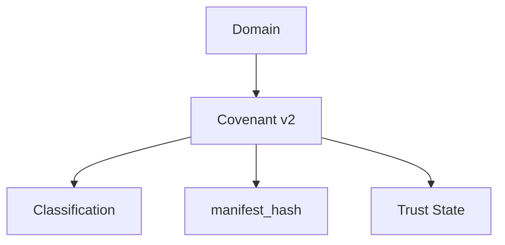
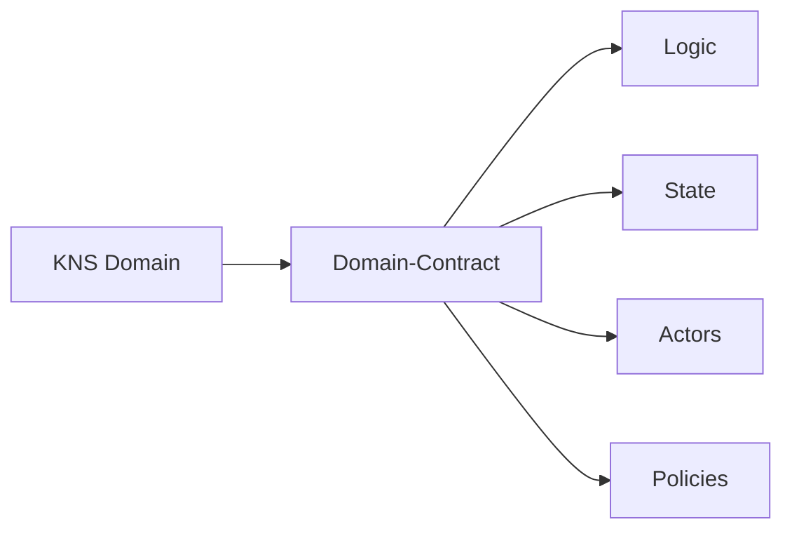
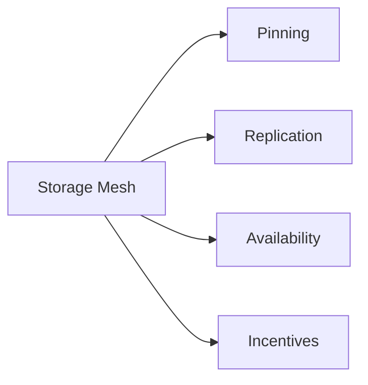
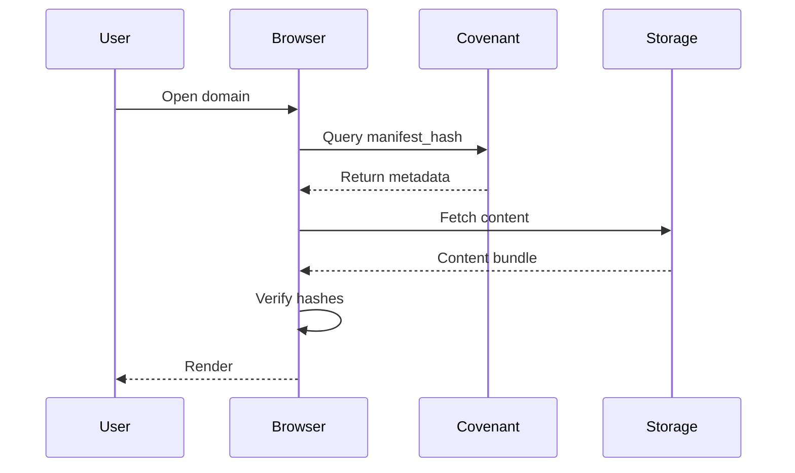
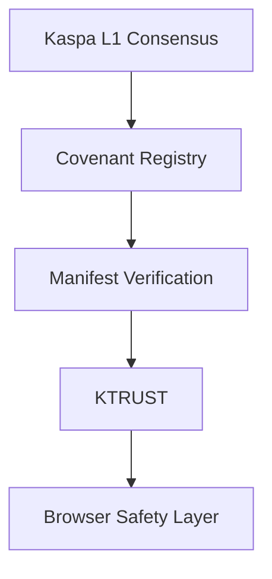
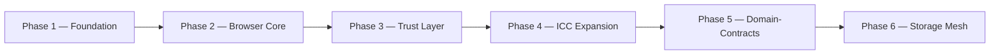

# 🟢⚫ KASPA Browser
### Decentralized Internet Protocol  
**Whitepaper v2.0 — Protocol Architecture & Future Upgrade Path**

---

## 2. Executive Summary

Kaspa Web is a decentralized internet protocol built on the Kaspa BlockDAG. It is designed to replace the core infrastructure of the traditional web — registrars, centralized indexers, mutable server-controlled content, and opaque trust systems — with verifiable, protocol-native primitives.

The architecture is organized around five components:

- **Permanent on-chain identities** (KNS domains) that cannot be seized, expired involuntarily, or reassigned outside of protocol rules
- **Inter-Contract Communication (ICC)**, a deterministic, stateless contract-execution layer that removes the need for centralized servers or RPC intermediaries
- **Covenant v2**, a domain classification and metadata-binding layer that attaches manifest hashes and trust state to each domain
- **Optional decentralized trust** via KTRUST, allowing applications to layer reputation and verification without imposing it as a requirement
- **A future upgrade path** toward autonomous Domain-Contracts, Subnet execution, and decentralized storage and indexing

Kaspa Web is fully operational today using stateless ICC contracts. The more advanced components of the architecture — autonomous Domain-Contracts, Subnet execution, and fully decentralized indexing — depend on a coordinated protocol upgrade, described in Section 5.

---

## 3. Vision & Problem Statement

### 3.1 Vision

Kaspa Web's stated goal is an internet in which identity, access, and trust belong to the people who use it, rather than being intermediated by registrars, platforms, or centralized service operators.

### 3.2 The Problem

The architecture of the conventional web concentrates control in a small number of chokepoints:

- **Registrars** act as gatekeepers of domain ownership, with the ability to suspend, reclaim, or transfer names outside the will of the holder
- **Centralized indexers** determine what content is discoverable, applying opaque and unaccountable ranking logic
- **Server-hosted content** is mutable by design, meaning what a user sees today may not be what existed yesterday, with no cryptographic guarantee of integrity
- **Trust systems** — certificate authorities, platform verification badges, and similar mechanisms — are opaque, centrally issued, and not independently verifiable

Kaspa Web's design goal is to remove these dependencies by substituting cryptographic verification and deterministic, protocol-level logic for institutional trust.

---

## 4. Technical Architecture v2.0

### 4.1 ICC — Inter-Contract Communication

ICC is the deterministic contract-execution layer underlying Kaspa Web. It allows contracts to communicate and compose without maintaining server-side state and without relying on remote procedure calls.

**Justification:** Because ICC contracts are stateless and execute deterministically, every node that processes a given contract call arrives at an identical result. This removes the need for a centralized server to mediate contract logic, and it allows contracts to be atomically composed — combined into larger operations that either fully succeed or fully fail — without introducing race conditions or inconsistent intermediate states.

### 4.2 Covenant v2 — ICC-Powered Domain Logic

Covenant v2 is the mechanism through which a KNS domain is bound to classification metadata, a manifest hash, and a trust state, all enforced through ICC logic.

**Justification:** By expressing the Covenant as an ICC contract rather than as off-chain metadata, a domain's classification, content pointer, and trust state all inherit the same deterministic guarantees as the rest of the protocol. This turns a domain from a bare identifier into a verifiable object whose properties can be checked directly against the chain.

### 4.3 Domain-Contracts (Future L1 Upgrade)

Domain-Contracts represent a planned future capability in which a domain is not merely a labeled identifier but an autonomous, stateful agent capable of enforcing its own rules and interacting with other contracts.

**Justification:** Attaching logic, state, actors, and policies directly to a domain would allow it to behave as a self-governing application rather than a static pointer to content. This is the mechanism by which Kaspa Web intends to support applications that need persistent, enforceable, on-chain behavior rather than one-off contract calls.

### 4.4 RFC — Protocol Evolution Mechanism

RFC (Request for Comments) is the formal process through which protocol upgrades are specified before they are introduced to the network. RFCs are required for Domain-Contracts, Subnets, the Storage Mesh, ICC expansion, and any hard-fork activation.

**Justification:** Routing all significant protocol changes through a public RFC process ensures that upgrades are documented, reviewed, and subject to community input before activation, rather than being deployed unilaterally.

---

## 5. Protocol Upgrade Notice — RFC + ICC Required

Full Domain-Contract functionality requires waiting for the upcoming RFC + ICC upgrade and a coordinated hard-fork.

Kaspa Web is fully functional today using stateless ICC contracts. However, the more advanced capabilities described in this document — autonomous Domain-Contracts, Subnet execution, decentralized indexing, and the Storage Mesh — are not yet active on the network. These capabilities depend on the formal RFC process described in Section 4.4 and on a coordinated hard-fork to activate the corresponding protocol changes.

---

## 6. Storage Layer Architecture v1.1

### 6.1 On-Chain Binding

The Kaspa chain itself stores only a minimal set of data for each domain:

- Domain ownership
- `manifest_hash`
- Storage pointers

Keeping on-chain storage minimal preserves chain performance while still giving every domain a verifiable anchor for its content.

### 6.2 Off-Chain Storage Sources

Content itself is retrieved from one or more off-chain sources:

- IPFS
- Kaspa Storage Mesh (future)
- Signed Bundles
- HTTP fallback

### 6.3 Kaspa Storage Mesh (Future RFC)

**Justification:** IPFS alone provides content-addressing but does not guarantee that any given piece of content remains available over time, since availability depends on whether some node chooses to keep pinning it. The Storage Mesh is designed to add replication guarantees and economic incentives on top of IPFS, so that availability does not depend on voluntary, unpaid pinning.

### 6.4 Verification Pipeline

**Justification:** By requiring the browser to independently verify the fetched content bundle against the on-chain `manifest_hash` before rendering, the pipeline ensures that content cannot be silently substituted or altered by any off-chain storage source without detection.

---

## 7. Security & Integrity Model v2.0

**Justification:** Security in Kaspa Web is layered rather than concentrated in a single component. Consensus guarantees the integrity of the underlying chain; the Covenant Registry guarantees the integrity of domain classification and metadata; manifest verification guarantees that fetched content matches what was declared on-chain; KTRUST provides an optional reputation layer; and the browser safety layer is the final checkpoint before content reaches the user. A failure at any single layer does not by itself compromise the guarantees provided by the layers beneath it.

---

## 8. Identity & Ownership v2.0

Domains within Kaspa Web are permanent, immutable identities. Once registered, a domain is not subject to renewal fees, involuntary expiration, or unilateral reclamation by a registrar. Ownership is determined entirely by on-chain state, and transfer of a domain occurs only through an explicit, cryptographically signed action by its current holder.

---

## 9. Governance & Evolution v2.0

Kaspa Web separates protocol governance from application governance. Protocol-level changes — to ICC, Covenant logic, Domain-Contracts, Subnets, or the Storage Mesh — proceed through the formal RFC process described in Section 4.4. Application-level governance, by contrast, is handled at a higher layer through mechanisms such as KTRUST and, once available, Domain-Contracts, allowing individual applications to define their own rules without requiring a protocol-wide change.

---

## 10. Roadmap v2.0

---

## 11. Future Outlook

Kaspa Web is designed to evolve into a fully decentralized internet stack in which domains are contracts, websites are trust-minimized, storage and indexing are decentralized, trust is optional rather than imposed, governance is open, and ICC underlies all executable logic — with Subnets providing the scalable execution layer needed to support it.
