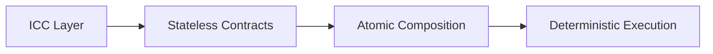
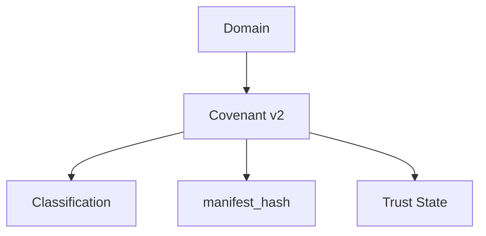
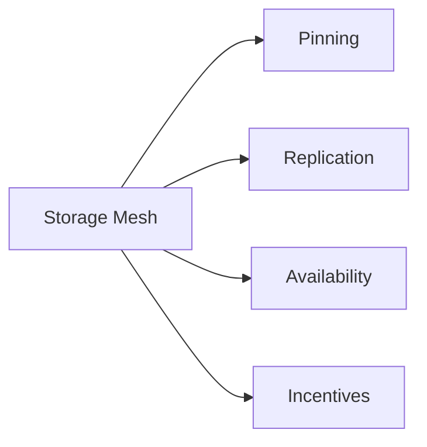
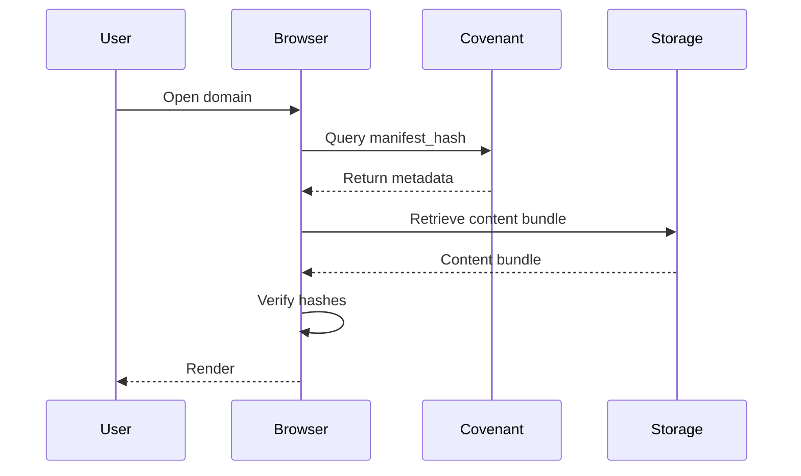
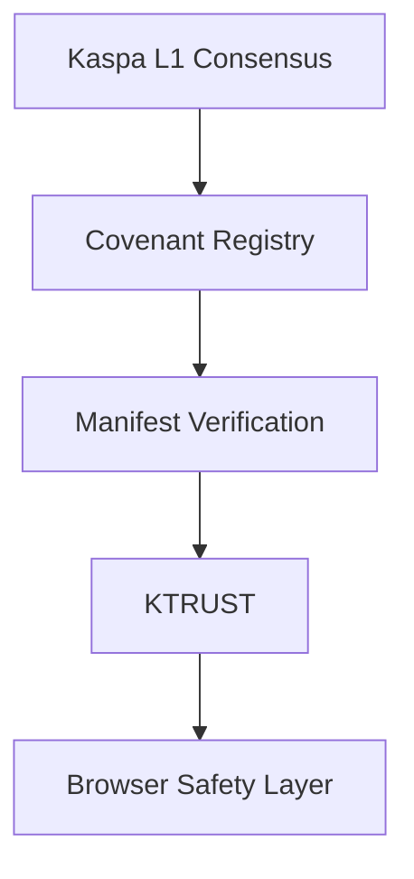
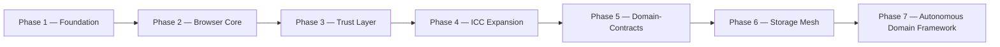

🟢⚫ KASPA WEB — Protocol Architecture v3.2
Decentralized Internet Protocol & Autonomous Domain Framework
0. Protocol Disclaimer — Theoretical Model & Existing Foundations
Kaspa Web, including the Autonomous Domain Framework and the Domain‑Contract architecture, represents a forward‑looking protocol design.
While the conceptual model presented in this document is complete and internally consistent, significant portions of the system are currently theoretical and depend on future protocol upgrades.

As stated in the original specification:

“Full Domain-Contract functionality requires waiting for the upcoming RFC + ICC upgrade and a coordinated hard-fork.”
“Where a Covenant v2 UTXO carries state and classification, a Domain-Contract additionally carries its own logic, defined actor permissions, and enforceable policies.”

✔ What exists today
The foundational components already exist on Kaspa L1, including:

Covenant v2

ICC primitives (current subset)

Manifest binding

KNS identity

Stateless validation

DA anchoring

Browser-side verification

These provide a real, working base layer enabling decentralized domains, content binding, and trust signaling.

✔ What is still theoretical
The following components require:

RFC ratification

ICC expansion

consensus-level activation

coordinated hard-fork

These include:

Domain‑Contracts

Autonomous Domain Framework (full execution)

Storage Mesh incentives & slashing

Trust-driven autonomous behaviors

State commitments for programmable agents

Execution semantics beyond current Covenant rules

✔ Contribution Notice — KTRUST.KAS
This work is provided freely to the Kaspa ecosystem.
Contributions to KTRUST.KAS support:

protocol research

architectural refinement

documentation

developer tooling

trust-layer modeling

autonomous domain safety frameworks

1. Executive Summary
Kaspa Web is a decentralized internet protocol built natively on top of the Kaspa BlockDAG. It defines an architecture through which domains, content, identity, and trust can exist entirely on-chain and off-chain in a cryptographically verifiable manner, without reliance on centralized hosting providers, certificate authorities, or DNS registries.

The protocol is composed of interlocking layers: ICC, Covenant v2, manifest-driven content binding, Storage Mesh, and KTRUST.
This revised edition introduces the Autonomous Domain Framework, expanding the future Domain‑Contract model into a full architectural layer.

2. Vision & Problem Statement
Kaspa Web removes centralized control points by anchoring domain ownership, content integrity, and trust signaling directly to Kaspa’s BlockDAG.
Domains become censorship-resistant, cryptographically verifiable, and independent of traditional registrars.

3. Core Architecture Overview
Kaspa Web is built on six foundational pillars:

ICC

Covenant v2

Manifest Hash

Storage Layer

KTRUST

Autonomous Domain Framework

4. ICC — Inter‑Contract Communication
ICC defines deterministic contract physics for stateless UTXO-based contracts.
It enables atomic composition without introducing global state.

5. Covenant v2 — Domain Logic Layer
Covenant v2 binds:

classification

manifest_hash

trust metadata

directly into the domain’s on-chain identity.

🟢 6. Autonomous Domain Framework (ADF)
The evolution from static domains to autonomous on-chain entities
ADF formalizes how domains transition from passive Covenant records into self-governing, programmable agents anchored to Kaspa L1.

6.1 Purpose of the Framework
ADF defines how domains can:

execute logic

enforce policies

manage permissions

interact with other domains

participate in multi-party governance

operate autonomously

—all while remaining stateless at the consensus layer.

🟢 6.2 Components of an Autonomous Domain (Updated)
An Autonomous Domain includes the following structural components:

1. Domain Logic
Deterministic rules encoded in the Domain‑Contract.

2. State Commitments
Merkle-root anchored off-chain state snapshots.

3. Actor Permissions
Role-based access control for owners, delegates, publishers, and agents.

4. Policy Enforcement
Consensus-enforced rules governing updates, transfers, and governance.

5. Inter-Domain Communication (ICC)
Deterministic messaging between autonomous domains.

6. Autonomous Lifecycle Budget (NEW)
A cryptographically enforced economic resource pool that governs the domain’s operational autonomy.
The budget allows the domain to:

fund automated actions

pay for storage commitments

compensate trust evaluators

interact economically with other autonomous domains

maintain long-term sustainability

All spending is constrained by covenant rules, preventing overspending or unauthorized actions.

🟢 6.3 Autonomous Behaviors (Updated)
Autonomous Domains can perform:

1. Autonomous Content Updates
Triggered or scheduled manifest changes.

2. Multi-Party Governance Execution
Quorum-based decisions, multi-sig enforcement, delegated publishing.

3. Event-Driven Reactions
ICC events, fraud proofs, trust changes.

4. Economic Self-Management
Lifecycle budget allocation and spending.

5. Agent-to-Agent Coordination
Interaction with AI agents and autonomous wallets.

6. Trust-Based Interaction (NEW)
Domains can initiate or restrict interactions based on KTRUST reputation signals:

prefer high-trust domains

reject low-trust or malicious domains

adjust policies dynamically

form trust-based autonomous networks

This transforms domains into social agents within a decentralized trust graph.

7. RFC — Protocol Evolution Mechanism
The RFC process governs protocol-level changes, ensuring safety and backward compatibility.

8. Protocol Upgrade Notice
Domain‑Contracts and ADF require future ICC expansion and a hard-fork.
Covenant v2 and manifest binding remain fully functional today.

9. Storage Layer Architecture v1.1
Includes:

manifest_hash binding

IPFS

Storage Mesh (future)

signed bundles

HTTP fallback

All content is verified against the on-chain manifest.

9.4 Verification Pipeline

10. Security & Integrity Model v2.0
Layered guarantees:

11. Identity & Ownership v2.0
Domains are owned via KNS and enforced by consensus.
No registrar can revoke or seize a domain.

12. Governance Model
Two layers:

Protocol Governance (RFC)

Application Governance (Domain‑Contract policies)

13. Roadmap v3.2

14. Future Outlook
Kaspa Web evolves toward:

autonomous domains

programmable governance

agent-to-agent communication

decentralized hosting

trust-driven internet architecture

ADF is the foundation for a future where domains behave as autonomous agents within a decentralized web.
